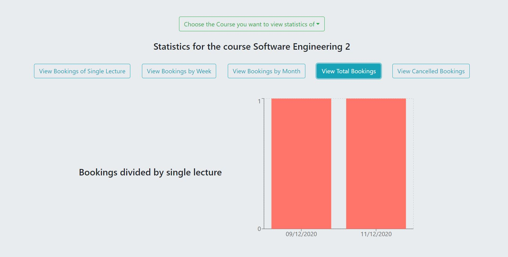
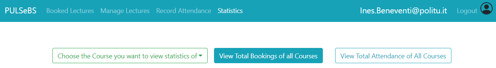

# System Testing Document

Authors:
- Team 14

# Contents
In this document you can find the documentation about our system testing. For each test we will describe each step necessary to complete the tested functionality, also attaching various summary screenshots. 

- [List of stories](#list-of-stories)
  - [Sprint 1](#sprint-1)
	- [Story 1](#story-1)
	- [Story 2](#story-2)
	- [Story 3](#story-3)
	- [Story 4](#story-4)
	- [Story 5](#story-5)
  - [Sprint 2](#sprint-2)
	- [Story 6](#story-6)
	- [Story 7](#story-7)
	- [Story 8](#story-8)
	- [Story 9](#story-9)
	- [Story 10](#story-10)
  - [Sprint 3](#sprint-3)
	- [Story 11](#story-11)
	- [Story 12](#story-12)
	- [Story 13](#story-13)
	- [Story 14](#story-14)
	- [Story 15](#story-15)
	- [Story 16](#story-16)
  - [Sprint 4](#sprint-4)
	- [Story 17](#story-17)
	- [Story 18](#story-18)
	- [Story 19](#story-19)
	- [Story 20](#story-20)
	- [Story 21](#story-21)
	- [Story 22](#story-22)
	- [Story 23](#story-23)
	- [Story 24](#story-24)

# List of stories

## Sprint 1

### Story 1 
##### As a student I want to book a seat for one of my lectures so that I can attend it.
#### Test 1.1 (A student books an available lecture)
- Like a student I need to put my credentials in the login form and then press the button `Login`. 

- After the login success, I can see my home page with two links in the header.

- If I click on `Bookable Lectures` I can see the list of the bookable lectures. 

- For book a lecture I need to press the button `Book` of the lecture that I'm interested in. After the click, a modal is shown asking for confirmation.

- If I click `Yes`, another modal is shown with the confirmation message. 

- Now the list of available lectures is updated with the booked lectures.

### Story 2 
##### As a teacher I want to get notified of the number of students attending my next lecture so that I am informed.
#### Test 2.1 (A teacher receives a mail )
- As a teacher I receive a mail at 23:00 with the number of students booked for my next lecture.

### Story 3 
##### As a teacher I want to access the list of students booked for my lectures so that I am informed.
#### Test 3.1 (A teacher accesses the list of student booked but no students are available)
- Like a teacher I need to put my credentials in the login form and then press the button `Login`.

- After the login success, I can see my home page with three links in the header

- If I click on `Booked Lectures` I can see the list of the students booked for my next lectures. In this case, there are zero bookings.

#### Test 3.2 (A teacher accesses to list of student booked)
- Like a teacher I need to put my credentials in the login form and then press the button `Login`.

- After the login success, I can see my home page with three links in the header

- If I click on `Booked Lectures` I can see the list of the students booked for my next lectures. In this case, there are some bookings.

### Story 4 
###### As a student I want to get an email confirmation of my booking so that I am informed.
#### Test 4.1 (A student books an available lecture and receives a mail confirmation)
- Like a student I need to put my credentials in the login form and then press the button `Login`. 

- After the login success, I can see my home page with two links in the header.

- If I click on `Bookable Lectures` I can see the list of the bookable lectures. 

- For booking a lecture I need to press the button `Book` of the lecture that I'm interested in. After the click, a modal is shown asking for confirmation.

- If I click `Yes`, another modal is shown with the confirmation message and a mail is sent. 

- Now the list of available lectures is updated with the booked lectures.

### Story 5 
###### As a student I want to cancel my booking so that I am free.
#### Test 5.1 (A student deletes a booked lecture)
- Like a student I need to put my credentials in the login form and then press the button `Login`. 

- After the login success, I can see my home page with two links in the header.

- If I click on `Bookable Lectures` I can see the list of the bookable lectures. 

- For deleting a lecture I need to press the button `Delete` of the lecture that I'm not interested in anymore. After the click, a modal is shown with asking for confirmation.

- If I click `Yes`, another modal is shown with the confirmation message. 

- Now the list of available lectures is updated with the unbooked lectures.

## Sprint 2

### Story 6 
###### As a student I want to access a calendar with all my bookings for the upcoming weeks.
#### Test 6.1 (A student accesses a calendar without booked lessons)
- Like a student I need to put my credentials in the login form and then press the button `Login`. 

- After the login success, I can see my home page with two links in the header.

- If I click on `My Booked Lectures` I can see the calendar with my booked lectures. In this test there are no booked lessons.

#### Test 6.2 (A student accesses a calendar in week view)
- Like a student I need to put my credentials in the login form and then press the button `Login`. 

- After the login success, I can see my home page with two links in the header.

- If I click on `My Booked Lectures` I can see the calendar with my booked lectures. In this test I use the `Week` view of calendar, the default one.

#### Test 6.3 (A student accesses a calendar in day view)
- Like a student I need to put my credentials in the login form and then press the button `Login`. 

- After the login success, I can see my home page with two links in the header.

- If I click on `My Booked Lectures` I can see the calendar with my booked lectures. The default view is the week view.

- If I click on the button in the right side of the calendar and I press `Day`, I can see the day view of my booked lectures.

#### Test 6.4 (A student accesses a calendar in month view)
- Like a student I need to put my credentials in the login form and then press the button `Login`. 

- After the login success, I can see my home page with two links in the header.

- If I click on `My Booked Lectures` I can see the calendar with my booked lectures. The default view is the week view.

- If I click on the button in the right side of the calendar and I press `Month`, I can see the month view of my booked lectures.

#### Test 6.5 (A student accesses a calendar in week view and click on the lesson)
- Like a student I need to put my credentials in the login form and then press the button `Login`. 

- After the login success, I can see my home page with two links in the header.

- If I click on `My Booked Lectures` I can see the calendar with my booked lectures. The default view is the week view.

- If I click on the button in the right side of the calendar and I press `Month`, I can see the month view of my booked lectures.

- If I click on one lesson in the calendar, a popup with all the information about the lecture is shown.

### Story 7 
###### As a teacher I want to cancel a lecture up to 1h before its scheduled time.
#### Test 7.1 (A teacher tries to cancel a lecture but the time is expired)
- Like a teacher I need to put my credentials in the login form and then press the button `Login`.

- After the login success, I can see my home page with three links in the header

- If I click on `Manage Lectures` I can see the list of my lectures. 

- If I click on the button `Delete`, I should be able to delete the lecture only if this moment is before 1h the scheduled time. If I click, a modal asking for confirmation is shown.

- If I click on the button `Yes`, in this case a modal with the information about the expired time is shown and the deletion is blocked.

#### Test 7.2 (A teacher tries to cancel a lecture and the time is not expired)
- Like a teacher I need to put my credentials in the login form and then press the button `Login`.

- After the login success, I can see my home page with three links in the header

- If I click on `Manage Lectures` I can see the list of my lectures. 

- If I click on the button `Delete`, I should be able to delete the lecture only if this moment is before 1h the scheduled time. If I click, a modal asking for confirmation is shown.

- If I click on the button `Yes`, in this case a modal with the information about the success is shown.

### Story 8 
###### As a student I want to get notified when a lecture is cancelled.
#### Test 8.1 (A student receives an email when the teacher cancels a lecture when he is booked )
- As a student I receive an email when the teacher cancels one of my booked lectures 

### Story 9
###### As a teacher I want to turn a presence lecture into a distance one up to 30 mins before its scheduled time.
#### Test 9.1 (A teacher tries to turn a presence lecture into a distance one but the time is expired)
- Like a teacher I need to put my credentials in the login form and then press the button `Login`.

- After the login success, I can see my home page with three links in the header

- If I click on `Manage Lectures` I can see the list of my lectures. 

- If I click on the button `Switch to Virtual`, I should be able to switch the lecture only if this moment is before 30m the scheduled time. If I click, a modal asking for confirmation is shown.

- If I click on the button `Yes`, a modal with the information about the expired time is shown and the change is blocked.

#### Test 9.2 (A teacher tries to turn a presence lecture into a distance one and the time is not expired)
- Like a teacher I need to put my credentials in the login form and then press the button `Login`.

- After the login success, I can see my home page with three links in the header

- If I click on `Manage Lectures` I can see the list of my lectures. 

- If I click on the button `Switch to Virtual`, I should be able to switch the lecture only if this moment is before 30m the scheduled time. If I click, a modal asking for confirmation is shown.

- If I click on the button `Yes`, a modal with the information about the success is shown.

- The new list of lectures is available with the new information about the virtual lecture.

### Story 10
###### As a teacher I want to access the historical data about bookings so that I can plan better.
#### Test 10.1 (A teacher accesses to the statistics page but no data is present in the system)
- Like a teacher I need to put my credentials in the login form and then press the button `Login`.

- After the login success, I can see my home page with three links in the header

- If I click on `Statistics` I can see the statistics of my lectures. 

- After the selection of the course, I can choose one of the different view of the stats. 

- If I click on `View Booking of single lecture`, a dropdown menu is shown with all my lectures.

- If I click on the lecture, in this test, a message is shown because there aren't available data for the selected lecture.

#### Test 10.2 (A teacher accesses to the statistics page and selects the single lecture view)
- Like a teacher I need to put my credentials in the login form and then press the button `Login`.

- After the login success, I can see my home page with three links in the header

- If I click on `Statistics` I can see the statistics of my lectures. 

- After the selection of the course, I can choose one of the different view of the stats. 

- If I click on `View Bookings of single lecture`, a dropdown menu is shown with all my lectures.

- If I click on the lecture, in this test, a graph is shown.

#### Test 10.3 (A teacher accesses to the statistics page and selects the week view)
- Like a teacher I need to put my credentials in the login form and then press the button `Login`.

- After the login success, I can see my home page with three links in the header

- If I click on `Statistics` I can see the statistics of my lectures. 

- After the selection of the course, I can choose one of the different view of the stats. 

- If I click on `View Bookings by Week`, a graph is shown.

#### Test 10.4 (A teacher access to the statistics page and select the month view)
- Like a teacher I need to put my credentials in the login form and then press the button `Login`.

- After the login success, I can see my home page with three links in the header

- If I click on `Statistics` I can see the statistics of my lectures. 

- After the selection of the course, I can choose one of the different view of the stats. 

- If I click on `View Bookings by Month`, a graph is shown.

#### Test 10.5 (A teacher accesses to the statistics page and selects the total bookings view)
- Like a teacher I need to put my credentials in the login form and then press the button `Login`.

- After the login success, I can see my home page with three links in the header

- If I click on `Statistics` I can see the statistics of my lectures. 

- After the selection of the course, I can choose one of the different view of the stats. 

- If I click on `View Total Bookings`, a graph is shown.

#### Test 10.6 (A teacher accesses to the statistics page and selects the cancelled bookings view)
- Like a teacher I need to put my credentials in the login form and then press the button `Login`.

- After the login success, I can see my home page with three links in the header

- If I click on `Statistics` I can see the statistics of my lectures. 

- After the selection of the course, I can choose one of the different view of the stats. 

- If I click on `View Cancelled Bookings`, a graph is shown.

## Sprint 3

### Story 11
###### As a booking manager I want to monitor usage (booking, cancellations, attendance) of the system.

#### Test 11.1 (A booking manages accesses the system and views the statistics page for all courses, where he can see the total amount of bookings for all courses present)

- Like a booking manager I need to put my credentials in the login form and then press the `Login` button.

- After a successful login I see my homepage with a welcome message, buttons for selecting the way I want to see statistics and a graph.

- Since the button `View Total Bookings of all Courses` is active I can scroll down and see a graph with all bookings made for all courses in the university.

#### Test 11.2 (A booking manager accesses the system and selects a course for which there are no bookings)

- Like a booking manager I need to put my credentials in the login form and then press the `Login` button.

- After a successful login I click on the dropdown menu to select the course of which I want to see statistics of.

- After selecting the course `Analisi Matematica II` taught by professor Landro Toscano I can see the buttons listing all possible options.

- If I select the option `Bookings by Week` I see a message saying that there are no statistics about bookings available for the course I selected.

#### Test 11.3 (A booking manager accesses the system and views statistics about bookings of a lecture for a given course, looking for both a lecture with statistics available and one without statistics available)

- Like a booking manager I need to put my credentials in the login form and then press the `Login` button.

- After a successful login I click on the dropdown menu to select the course of which I want to see statistics of.

- After selecting the course `Economia e finanza d'impresa` taught by professor Ines Beneventi I can see the buttons listing all possible options.

- After clicking on the button `View Bookings of Single Lecture` a dropdown menu listing all lectures of the course appears.

- If I select in the menu the lesson `18/12/2020 10:00 - 13:00` a graph is shown.

- If I select in the menu the lesson `25/12/2020 10:00 - 13:00` a message reporting that no bookings are available for said lecture is shown.

#### Test 11.4 (A booking manager accesses the system and views statistics about a course related to bookings made in separate weeks, separate months and for separate lectures)

- Like a booking manager I need to put my credentials in the login form and then press the `Login` button.

- After a successful login I click on the dropdown menu to select the course of which I want to see statistics of.

- After selecting the course `Economia e finanza d'impresa` taught by professor Ines Beneventi I can see the buttons listing all possible options.

- After clicking on the button `View Bookings by Week` a graph listing all bookings made in different weeks is shown.

- After clicking on the button `View Bookings by Month` a graph listing all bookings made in different months is shown.

- After clicking on the button `View Total Bookings` a graph listing all bookings made for different lectures is shown.

#### Test 11.5 (A booking manager accesses the system and selects a course for which there are no statistics about cancelled bookings)

- Like a booking manager I need to put my credentials in the login form and then press the `Login` button.

- After a successful login I click on the dropdown menu to select the course of which I want to see statistics of.

- After selecting the course `Economia e finanza d'impresa` taught by professor Ines Beneventi I can see the buttons listing all possible options.

- After clicking on the button `View Cancelled Bookings` a message reporting that there are no statistics is shown.

#### Test 11.6 (A booking manager accesses the system and selects a course for which he wants to see statistics about cancelled bookings)

- Like a booking manager I need to put my credentials in the login form and then press the `Login` button.

- After a successful login I click on the dropdown menu to select the course of which I want to see statistics of.

- After selecting the course `Economia e finanza d'impresa` taught by professor Ines Beneventi I can see the buttons listing all possible options.

- After clicking on the button `View Cancelled Bookings` a graph is shown.

#### Test 11.7 (A booking manager accesses the system and chooses to see statistics about cancelled lectures, when there are no cancelled lectures)

- Like a booking manager I need to put my credentials in the login form and then press the `Login` button.

- After a successful login I click on the `View Cancelled Lectures of all Courses` and a message reporting that there are no statistics is shown.

#### Test 11.8 (A booking manager accesses the system and chooses to see statistics about cancelled lectures)

- Like a booking manager I need to put my credentials in the login form and then press the `Login` button.

- After a successful login I click on the `View Cancelled Lectures of all Courses` and a graph is shown.

#### Test 11.9 (A booking manager accesses the system to see statistics about in presence attendance for a course that has no attendance registered yet)

- Like a booking manager I need to put my credentials in the login form and then press the `Login` button.

- After a successful login I click on the dropdown menu to select the course of which I want to see statistics of.

- After selecting the course `Analisi Matematica II` taught by professor Landro Toscano I can see the buttons listing all possible options.

- If I click on the button `View Attendance of all Lectures` a message reporting that there are no statistics available is shown.

#### Test 11.10 (A booking manager accesses the system to see statistics about in presence attendance)

- Like a booking manager I need to put my credentials in the login form and then press the `Login` button.

- After a successful login I click on the dropdown menu to select the course of which I want to see statistics of.

- After selecting the course `Economia e finanza d'impresa` taught by professor Ines Beneventi I can see the buttons listing all possible options.

- If I click on the button `View Attendance of all Lectures` a graph is shown.

### Story 12
###### As a support officer I want to upload the list of students, courses, teachers, lectures, and classes to setup the system.

#### Test 12.1 (A support officer accesses the system to upload a file)
- As a support officer I put my credentials in the login form to access the system.

- After the login success, I can see my the load page.

- If I click the Browse Button, a folder is open with the list of files.

- After the selection of a file, all the information is shown

- If I click the Upload Button, a spinner is shown

- At the end, a modal with the success information is shown

#### Test 12.2 (A support officer accesses the system to upload a file, but the file has some error)
- As a support officer I put my credentials in the login form to access the system.

- After the login success, I can see my the load page.

- If I click the Browse Button, a folder is open with the list of files.

- After the selection of a file, all the information is shown.

- If the file is corrupted, a modal is shown.

### Story 13
###### As a student I want to be put in a waiting list when no seats are available in the required lecture.

#### Test 13.1 (A student accesses the system to book a seat in a lecture, and gets put in a waiting list since all seats are booked)
- As a student I put my credentials in the login form to access the system.

- Once in the homepage I click on the link `Bookable Lectures` in the header.

- In this page I want to book a seat for the lesson that takes place on 18/12/2020 for the course `Ingegneria della Qualità` but all 50 seats are booked, so I can only click on the `Add in Waiting List` button.

- Once I click on the button a pop-up asks me if I want to confirm my insertion in the waiting list.

- If I click on the `Yes` button a new pop-up appears, confirming my insertion in the waiting list.

### Story 14 
###### As a student in the waiting list I want to be added to the list of students booked when someone cancels their booking so that I can attend the lecture.

#### Test 14.1 (shared with [Story 15](#story-15))

- As a student that is already booked for a lecture that wants to delete his booking I insert my credentials to access the system.

- Once in the homepage I click on the `Bookable Lectures` link in the header.

- In this page I want to delete my booking for the lecture taking place on 18/12/2020 for the course `Ingegneria della Qualità`, so I click on the "Delete" button.

- Clicking on the button opens a pop-up asking me if I want to delete my booking.

- If I click on the `Yes` button a new pop-up confirms the booking cancellation.

- After I close the popup I can see that for the lecture I just cancelled my booking for the button says `Add to Waiting List`. This is because a student was already in the waiting list, as seen in [Test 33](#test-33-a-student-accesses-the-system-to-book-a-seat-in-a-lecture-and-gets-put-in-a-waiting-list-since-all-seats-are-booked)

- If I access, as the student that was put in the waiting list during [Test 33](#test-33-a-student-accesses-the-system-to-book-a-seat-in-a-lecture-and-gets-put-in-a-waiting-list-since-all-seats-are-booked) to my mail account I can see a notification telling me I was taken from the waiting list and my seat was correctly booked after someone else deleted his booked seat.

- Then, as the same student, I access the system with my credentials.

- Once in the homepage I click on the `Bookable Lectures` link in the header.

- In this page I can now see that I am booked for the lesson taking place on 18/12/2020 for the course `Ingegneria della Qualità`, since there's now a `Delete` button in place of the `Add in Waiting List` that was there before.

### Story 15
###### As a student I want to get notified when I am taken from the waiting list so that I can attend the lecture.

#### Test 15.1 (shared with [Story 14](#story-14))

### Story 16 
###### As a booking manager I want to generate a contact tracing report starting with a positive student so that we comply with safety regulations.

#### Test 16.1 (A booking manager accesses the system and generates a contact report starting with a reported positive student)

- As a booking manager I insert my credentials so I can access the system.

- Once in the homepage I click on the link `Contact Tracing` in the header.

- In this page I can insert the identifier of a student (or a teacher) that has been reported as positive. Clicking on the `Download Report` button will generate a contact report based on that student.

- After clicking on the button I have downloaded two files containing the contact report (a PDF and a CSF)

- If I open the CSF file I can see the list of students that took part in a lesson together with the reported positive student.

- In the same way, if I open the PDF file I can also see the list of contacts.

## Sprint 4

### Story 17
###### As a support officer I want to update the list of bookable lectures

#### Test 17.1 (A support officer accesses the system and sets lectures of all courses of the first year to be only virtual)

- As a support officer I need to put my credentials in the login form and then press the button `Login`.

- Once in the homepage I click on the `Update Lectures Bookability` link in the header.

- In the new page I click on the `Year` button, then I select the checkbox corresponding to the option `Year 1` and click on the `Confirm Selection` button.

- In the pop-up that appears I confirm that 8 courses will be changed to virtual by clicking on the `Yes` button. A message then appears informing me that the changes have been made correctly.

#### Test 17.2 (A support officer accesses the system and sets lectures of all courses of the second year in the second semester to be only virtual)

- As a support officer I need to put my credentials in the login form and then press the button `Login`.

- Once in the homepage I click on the `Update Lectures Bookability` link in the header.

- In the new page I click on the `Semester` button, I deselect the button corresponding to the option `Year 1` and select the one corresponding to `Year 2`. I then select the checkbox corresponding to the option `Semester 2` and click on the `Confirm Selection` button.

- In the pop-up that appears I confirm that 10 courses will be changed to virtual by clicking on the `Yes` button. A message then appears informing me that the changes have been made correctly.

#### Test 17.3 (A support officer accesses the system and sets lectures in an interval of dates to be only virtual)

- As a support officer I need to put my credentials in the login form and then press the button `Login`.

- Once in the homepage I click on the `Update Lectures Bookability` link in the header.

- In the new page I click on the `Custom Date` button, I select `08/03/2021` as starting date and `31/03/2021` as ending date and click on the `Confirm Selection` button.

- In the pop-up that appears I confirm that lectures in the interval will be changed to virtual by clicking on the `Yes` button. A message then appears informing me that the changes have been made correctly.

### Story 18
###### As a teacher I want to record the students present at my lecture among those booked so that I can keep track of actual attendance

#### Test 18.1 (A teacher accesses the system to register attendance in a day when there are no lectures)

- As a teacher I need to put my credentials in the login form and then press the button `Login`.

- After login, I click on the `Record Attendance` link in the header of the home page.

- In the new page I see a message telling me that there are no lectures in presence today.

#### Test 18.2 (A teacher accesses the system to register attendance for a lecture that happened in the past hours)

- As a teacher I need to put my credentials in the login form and then press the button `Login`.

- After login, I click on the `Record Attendance` link in the header of the home page.

- In the new page I see a list of all students that booked a seat for a lecture that took place today.

- If I click on the `Record as Present` button in the line corresponding to the student with ID `902800` a message appears marking that student as present.

### Story 19
###### As a teacher I want to access the historical data about presence so that I can assess the course

#### Test 19.1 (A teacher accesses the system to view statistics about presence for a course which has no such statistics)

- As a teacher I need to put my credentials in the login form and then press the button `Login`.

- After login, I click on the `Statistics` link in the header of the home page.

- In the new page I choose from the dropdown menu the course `Metodi di finanziamento delle imprese`

- Among all new buttons I click on the one saying `View Attendance of All Lectures`

- After clicking on the button a message appears saying there are no statistics.

#### Test 19.2 (A teacher accesses the system and views statistics about attendance of a course)

- As a teacher I need to put my credentials in the login form and then press the button `Login`.

- After login, I click on the `Statistics` link in the header of the home page.

- In the new page I choose from the dropdown menu the course `Metodi di finanziamento delle imprese`

- Among all new buttons I click on the one saying `View Attendance of All Lectures`

- After clicking on the button I see a graph reporting statistics about attendance.

#### Test 19.3 (A teacher accesses the system to view statistics about total attendance of all his courses)

- As a teacher I need to put my credentials in the login form and then press the button `Login`.

- After login, I click on the `Statistics` link in the header of the home page.

- In the new page I click on the button `View Total Attendance of All Courses`.

- After clicking on the button I see a graph reporting total attendance of all courses.

### Story 20
###### As a support officer I want to modify the schedule of courses so that data is up-to-date

#### Test 20.1 (A support officer accesses the system and changes the schedule of a course)

- As a support officer I need to put my credentials in the login form and then press the button `Login`.

- Once in the homepage I click on the `Modify Data` link in the header.

- In the new page I click on the dropdown menu and look for the course `Economia e finanza d'impresa - Ines Beneventi`

- In the new list I click on the `Modify Schedule` button in the line corresponding to the schedule related to Friday (`fri`)

- In the pop-up I select `mon` as new day for the scheduled lecture, `8:30` as the starting time for the lecture, `3 hours` as the length of the lecture and `2` as the new classroom, then I click on the `Submit Modifications` button to confirm my changes.

- After the pop-up closes I see in the list the changes I made to the schedule.

#### Test 20.2 (A support officer accesses the system to change the schedule of a course, choosing a time when the teacher already has another lecture scheduled)

- As a support officer I need to put my credentials in the login form and then press the button `Login`.

- Once in the homepage I click on the `Modify Data` link in the header.

- In the new page I click on the dropdown menu and look for the course `Metodi di finanziamento delle imprese - Ines Beneventi`

- In the new list I click on the `Modify Schedule` button in the line corresponding to the schedule related to Monday (`mon`)

- In the pop-up I select `tue` as new day for the scheduled lecture, `16:00` as the starting time for the lecture, `1.5 hours` as the length of the lecture and `1` as the new classroom, then, after I click on the `Submit Modifications` button to confirm my changes, an error message appears telling me the inserted schedule is invalid.

#### Test 20.3 (A support officer accesses the system to change the schedule of a course, choosing as new classroom one that is already occupied)

- As a support officer I need to put my credentials in the login form and then press the button `Login`.

- Once in the homepage I click on the `Modify Data` link in the header.

- In the new page I click on the dropdown menu and look for the course `Economia e finanza d'impresa - Ines Beneventi`

- In the new list I click on the `Modify Schedule` button in the line corresponding to the schedule related to Friday (`fri`)

- In the pop-up I select `thu` as new day for the scheduled lecture, `10:00` as the starting time for the lecture, `3 hours` as the length of the lecture and `5` as the new classroom, then, after I click on the `Submit Modifications` button to confirm my changes, an error message appears telling me the selected classroom is already occupied.

### Story 21
###### As a student I want to get a notification when the schedule for a lecture I booked for is changed so that I am informed 

#### Test 21.1 (A student receives an email after the schedule related to a lesson he is booked for is changed) (following from [test 20.1](#test-201-a-support-officer-accesses-the-system-and-changes-the-schedule-of-a-course))

- As a student I access to my mail account and see an e-mail telling me that the schedule has changed

### Story 21-BIS
###### As a student I want to get a notification when the schedule for a lecture I booked for is turned from presence into a remote

#### Test 21.2 (A teacher changes a lecture to virtual and a student booked at that lecture receives an email for information)

- As a teacher I need to put my credentials in the login form and then press the button `Login`.

- In the homepage I click on the `Manage Lectures` link in the header.

- In the list in the new page I click on the `Switch to virtual` button in the line corresponding to the lesson of the course `Economia e finanza d'impresa` for the day 15/01/2021.

- After clicking I click `Yes` in the pop-up that has just appeared, so that I can see a message confirming the change.

- After closing the pop-up I see in the list that the `Switch to virtual` button in greyed out in the corresponding row of the list and the classroom is marked as `Virtual Classroom`.

- Then, as a student, I access my mailing account and see an e-mail informing me that the lesson I was booked for has switched to virtual.

### Story 22
###### As a student I want to access a tutorial for using the system so that I can use it properly

#### Test 22.1

### Story 23
###### As a teacher I want to access a tutorial for using the system so that I can use it correctly

#### Test 23.1

### Story 24
###### As a booking manager I want to generate a contact tracing report starting with a positive teacher so that we comply with safety regulations

#### Test 24.1 (A booking manager accesses the system and generates a contact report starting with a reported positive teacher)

- As a booking manager I insert my credentials so I can access the system.

- Once in the homepage I click on the link `Contact Tracing` in the header.

- In this page I can insert the identifier of a teacher (or a student) that has been reported as positive. Clicking on the `Download Report` button will generate a contact report based on that student.

- After clicking on the button I have downloaded two files containing the contact report (a PDF and a CSF)

- If I open the CSF file I can see the list of students that took part in a lesson together with the reported positive student.

- In the same way, if I open the PDF file I can also see the list of contacts.

- If no information about the person is found, a message will be displayed

